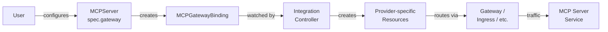

# Gateway Integration

The MCP Lifecycle Operator supports exposing MCP servers through external gateways. This allows clients outside the cluster to reach MCP servers via a shared ingress point, without requiring individual LoadBalancer services per server.

## How It Works

The gateway integration uses a provider-based design built around the `MCPGatewayBinding` CRD:

1. You configure `spec.gateway` on an MCPServer with a provider name and optional configuration
2. The operator creates an `MCPGatewayBinding` resource
3. An integration controller watches bindings for its provider and creates the appropriate gateway resources
4. The binding status is reflected back into the MCPServer status



This design is extensible - any provider can implement its own integration controller by watching `MCPGatewayBinding` resources filtered by `spec.provider`. The operator ships with two built-in providers: `httproute` for the [Kubernetes Gateway API](https://gateway-api.sigs.k8s.io/) and `kuadrant` for the [Kuadrant MCP Gateway](https://docs.kuadrant.io/latest/mcp-gateway/).

## MCPServer Configuration

Add `spec.gateway` to your MCPServer to enable gateway integration:

```yaml
apiVersion: mcp.x-k8s.io/v1beta1
kind: MCPServer
metadata:
  name: my-mcp-server
  namespace: default
spec:
  source:
    type: ContainerImage
    containerImage:
      ref: quay.io/containers/kubernetes_mcp_server:latest
  config:
    port: 8080
    path: /mcp
  gateway:
    provider: httproute
    configRef: mcp-gateway-config
```

| Field              | Required | Description                                                      |
|--------------------|----------|------------------------------------------------------------------|
| `gateway.provider` | Yes      | Provider name that identifies the integration controller          |
| `gateway.configRef` | No       | Name of a ConfigMap with provider-specific configuration          |

## MCPGatewayBinding

The operator automatically creates an `MCPGatewayBinding` when `spec.gateway` is set. This CRD is the contract between the operator and integration controllers:

```yaml
apiVersion: mcp.x-k8s.io/v1alpha1
kind: MCPGatewayBinding
metadata:
  name: my-mcp-server-gateway-binding
  namespace: default
spec:
  mcpServerRef: my-mcp-server
  provider: httproute
  configRef: mcp-gateway-config
status:
  url: http://mcp.example.com/mcp
  conditions:
    - type: Registered
      status: "True"
```

!!! note
    You do not create `MCPGatewayBinding` resources manually - the operator manages their lifecycle based on `spec.gateway`.

## Status

When gateway integration is active, the MCPServer status includes:

- A `GatewayRegistered` condition indicating whether the provider has processed the binding
- A `gatewayBinding` section with the binding name and provider
- The `address.url` overridden with the gateway endpoint (if the provider sets one)

```yaml
status:
  address:
    url: http://mcp.example.com/mcp
  gatewayBinding:
    name: my-mcp-server-gateway-binding
    provider: httproute
  conditions:
    - type: Accepted
      status: "True"
    - type: Available
      status: "True"
    - type: Verified
      status: "True"
    - type: GatewayRegistered
      status: "True"
```

## Removing Gateway Integration

Remove `spec.gateway` from the MCPServer to disable gateway integration:

```bash
kubectl patch mcpserver my-mcp-server --type=json \
  -p='[{"op": "remove", "path": "/spec/gateway"}]'
```

The operator deletes the `MCPGatewayBinding`, the provider's resources are cleaned up via owner references, and the MCPServer address reverts to the cluster-internal service URL.

## Reference Provider: `httproute`

The operator includes a reference integration controller for the `httproute` provider, which creates [Gateway API HTTPRoute](https://gateway-api.sigs.k8s.io/api-types/httproute/) resources.

### Prerequisites

- [Gateway API CRDs](https://gateway-api.sigs.k8s.io/guides/#installing-gateway-api) installed on the cluster
- A Gateway resource deployed and managed by a gateway controller (e.g., Envoy Gateway, Istio, Cilium)

!!! note
    The operator checks for the HTTPRoute CRD at startup. If Gateway API CRDs are not installed, the `httproute` controller is skipped. Install them and restart the operator to enable it.

### ConfigMap Format

The `httproute` provider reads its configuration from a ConfigMap:

```yaml
apiVersion: v1
kind: ConfigMap
metadata:
  name: mcp-gateway-config
  namespace: default
data:
  gateway-name: my-gateway
  gateway-namespace: gateway-system
  route-hostname: mcp.example.com
```

| Key                 | Required | Description                                       |
|---------------------|----------|---------------------------------------------------|
| `gateway-name`      | Yes      | Name of the existing Gateway resource              |
| `gateway-namespace` | Yes      | Namespace where the Gateway resource lives          |
| `route-hostname`    | No       | Hostname to set on the HTTPRoute for routing        |
| `public-hostname`   | No       | Public hostname for the status URL. When omitted, falls back to `route-hostname`, then to the Gateway's status addresses |

!!! warning "Cross-namespace routing"
    When the Gateway lives in a different namespace than the MCPServer (as in this example), the Gateway must explicitly allow cross-namespace routes. By default, Gateway API sets `allowedRoutes.namespaces.from: Same`, which rejects routes from other namespaces. Configure the Gateway listener to accept routes from the MCPServer's namespace:

    ```yaml
    listeners:
      - name: http
        port: 80
        protocol: HTTP
        allowedRoutes:
          namespaces:
            from: All  # or use Selector to restrict to specific namespaces
    ```

### What It Creates

For each registered binding, the controller creates an HTTPRoute that:

- References the specified Gateway as a parent
- Matches the MCPServer's path (default `/mcp`) using `PathPrefix`
- Routes traffic to the MCPServer's Service and port
- Sets the hostname if configured

The HTTPRoute is owned by the MCPGatewayBinding, so it is automatically deleted when the binding is removed.

### Verify

```bash
# MCPGatewayBinding should be Registered
kubectl get mcpgatewaybindings

# HTTPRoute should exist
kubectl get httproutes

# MCPServer address should reflect the gateway URL
kubectl get mcpserver my-mcp-server -o jsonpath='{.status.address.url}'
```

## Kuadrant Provider: `kuadrant`

The operator includes an integration controller for the `kuadrant` provider, which registers MCP servers with the [Kuadrant MCP Gateway](https://docs.kuadrant.io/latest/mcp-gateway/). It creates a Gateway API HTTPRoute and a Kuadrant `MCPServerRegistration` resource that enables the MCP Gateway broker to discover and federate the server's tools and prompts.

### Prerequisites

- [Gateway API CRDs](https://gateway-api.sigs.k8s.io/guides/#installing-gateway-api) installed on the cluster
- [Kuadrant MCP Gateway](https://docs.kuadrant.io/latest/mcp-gateway/docs/guides/how-to-install-and-configure/) installed (provides the `MCPServerRegistration` CRD)
- A Gateway resource with an MCP listener (typically named `mcps`) managed by a gateway controller (e.g., Istio)

!!! note
    The operator checks for both the HTTPRoute and MCPServerRegistration CRDs at startup. If either is missing, the `kuadrant` controller is skipped. Install the required CRDs and restart the operator to enable it.

### ConfigMap Format

The `kuadrant` provider reads its configuration from a ConfigMap:

```yaml
apiVersion: v1
kind: ConfigMap
metadata:
  name: mcp-kuadrant-config
  namespace: default
data:
  gateway-name: mcp-gateway
  gateway-namespace: mcp-system
  prefix: myserver_
  section-name: mcps
```

| Key                 | Required | Default | Description                                                  |
|---------------------|----------|---------|--------------------------------------------------------------|
| `gateway-name`      | Yes      |         | Name of the existing Gateway resource                        |
| `gateway-namespace` | Yes      |         | Namespace where the Gateway resource lives                   |
| `route-hostname`    | No       | auto    | Hostname for the HTTPRoute. When omitted, auto-constructed from the Gateway listener's wildcard hostname (e.g., `*.mcp.local` + MCPServer `my-server` in namespace `team-a` = `my-server.team-a.mcp.local`). Set explicitly to override. |
| `public-hostname`   | No       | auto    | Public hostname for the status URL. When omitted, resolved via: MCPGatewayExtension `publicHost` → public listener hostname. Set explicitly to override all auto-resolution. |
| `prefix`            | Yes      |         | Tool/prompt name prefix for federation (e.g., `myserver_`)   |
| `section-name`      | No       | `mcps`  | Gateway listener section name for the parent reference       |

### What It Creates

For each registered binding, the controller creates:

1. An **HTTPRoute** that:
    - References the specified Gateway with the configured `sectionName` (default `mcps`)
    - Sets the hostname from `route-hostname` (or auto-constructed from the listener wildcard)
    - Matches the MCPServer's path (default `/mcp`) using `PathPrefix`
    - Routes traffic to the MCPServer's Service and port

2. An **MCPServerRegistration** (`mcp.kuadrant.io/v1alpha1`) that:
    - References the HTTPRoute via `targetRef`
    - Sets the MCP server path for the broker
    - Sets the tool/prompt prefix if configured
    - State is always `Enabled`

Both resources are owned by the MCPGatewayBinding, so they are automatically deleted when the binding is removed.

### MCPServer Configuration

```yaml
apiVersion: mcp.x-k8s.io/v1beta1
kind: MCPServer
metadata:
  name: my-mcp-server
  namespace: default
spec:
  source:
    type: ContainerImage
    containerImage:
      ref: quay.io/containers/kubernetes_mcp_server:latest
  config:
    port: 8080
    path: /mcp
  gateway:
    provider: kuadrant
    configRef: mcp-kuadrant-config
```

### Verify

```bash
# MCPGatewayBinding should be Registered
kubectl get mcpgatewaybindings

# HTTPRoute should exist
kubectl get httproutes

# MCPServerRegistration should exist
kubectl get mcpserverregistrations

# MCPServer address should reflect the gateway URL
kubectl get mcpserver my-mcp-server -o jsonpath='{.status.address.url}'
```

## Implementing a Custom Provider

Any provider needs to:

1. Create a controller that watches `MCPGatewayBinding` resources filtered by `spec.provider`
2. Read configuration from the ConfigMap referenced by `spec.configRef`
3. Create provider-specific resources owned by the binding (for automatic cleanup)
4. Update the binding status with a `Registered` condition and optionally set `status.url`

The MCPServer controller reflects the binding status automatically - your provider only needs to manage the `MCPGatewayBinding` status, not the MCPServer status directly.

### Adding an In-Tree Provider

The operator uses a provider registry so that `cmd/main.go` does not need per-provider setup code. To add a new in-tree provider:

1. Create a package under `internal/controller/providers/<name>/`
2. Implement a `Reconciler` with a `SetupWithManager(mgr ctrl.Manager) error` method that uses `providers.MatchesProvider` to filter bindings by provider name:

    ```go
    package myprovider

    import (
        ctrl "sigs.k8s.io/controller-runtime"
        "sigs.k8s.io/controller-runtime/pkg/builder"

        mcpv1alpha1 "github.com/kubernetes-sigs/mcp-lifecycle-operator/api/v1alpha1"
        "github.com/kubernetes-sigs/mcp-lifecycle-operator/internal/controller/providers"
    )

    const ProviderName = "myprovider"

    func init() {
        providers.Register(ProviderName, Setup)
    }

    func Setup(mgr ctrl.Manager) error {
        return (&Reconciler{
            Client: mgr.GetClient(),
            Scheme: mgr.GetScheme(),
        }).SetupWithManager(mgr)
    }

    func (r *Reconciler) SetupWithManager(mgr ctrl.Manager) error {
        return ctrl.NewControllerManagedBy(mgr).
            For(&mcpv1alpha1.MCPGatewayBinding{},
                builder.WithPredicates(providers.MatchesProvider(ProviderName))).
            // Owns(...), Watches(...), etc.
            Complete(r)
    }
    ```

3. Add a blank import in `cmd/main.go`:

    ```go
    // Gateway integration providers register themselves via init().
    // Add new providers here as blank imports.
    _ "github.com/kubernetes-sigs/mcp-lifecycle-operator/internal/controller/providers/httproute"
    _ "github.com/kubernetes-sigs/mcp-lifecycle-operator/internal/controller/providers/myprovider"
    ```

The `providers.SetupAll(mgr)` call in `cmd/main.go` handles the rest.

### Adding an Out-of-Tree Provider

An out-of-tree provider runs as a separate controller in its own deployment. It watches `MCPGatewayBinding` resources filtered by its provider name and manages its own resources independently. No changes to the operator are required - the provider needs RBAC access to watch and read `MCPGatewayBinding` resources, update their status, read referenced `ConfigMap` resources, and manage its provider-specific resources.