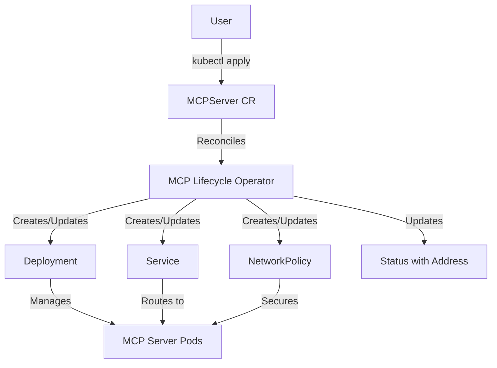

# Introduction

## What is MCP Lifecycle Operator?

The MCP Lifecycle Operator is a Kubernetes operator that automates the deployment and management of Model Context Protocol (MCP) servers. It provides a Kubernetes-native way to run MCP servers as production-ready services in your cluster.

## API Resources

### MCPServer

The core resource provided by this operator is `MCPServer`. It represents a deployed MCP server instance with the following key capabilities:

#### Source Configuration

Define where your MCP server container image comes from:

```yaml
spec:
  source:
    type: ContainerImage
    containerImage:
      ref: registry.io/mcp-server:v1.0.0
```

#### Custom Labels and Annotations

Add custom labels and annotations to the managed Deployment, PodTemplate, Service, and NetworkPolicy:

```yaml
spec:
  extraLabels:
    team: platform
    environment: production
  extraAnnotations:
    prometheus.io/scrape: "true"
```

The operator-managed keys `app` and `mcp-server` cannot be overridden by `extraLabels`. Annotations prefixed with `mcp.x-k8s.io/` cannot be overridden by `extraAnnotations`.

#### Server Configuration

Configure the server's networking, arguments, environment variables, and storage mounts:

```yaml
spec:
  config:
    port: 8080              # Server port (required)
    path: /mcp              # HTTP path (default: /mcp)
    arguments:              # Command-line arguments
      - --config
      - /etc/mcp-config/config.toml
    env:                    # Environment variables
      - name: LOG_LEVEL
        value: info
    envFrom:                # Load env vars from ConfigMaps/Secrets
      - configMapRef:
          name: mcp-config
```

#### Storage and Mounts

Mount ConfigMaps, Secrets, or EmptyDirs:

```yaml
spec:
  config:
    storage:
      - path: /etc/mcp
        source:
          type: ConfigMap
          configMap:
            name: mcp-server-config
      - path: /tmp
        permissions: ReadWrite
        source:
          type: EmptyDir
          emptyDir:
            sizeLimit: 100Mi
```

#### Runtime Configuration

Configure replicas, resource limits, health probes, and security:

```yaml
spec:
  runtime:
    replicas: 2
    resources:
      requests:
        cpu: "100m"
        memory: "128Mi"
      limits:
        cpu: "500m"
        memory: "256Mi"
    health:
      readinessProbe:
        httpGet:
          path: /healthz
          port: 8080
    security:
      serviceAccountName: mcp-viewer
      podSecurityContext:
        runAsNonRoot: true
        seccompProfile:
          type: RuntimeDefault
      securityContext:
        allowPrivilegeEscalation: false
        readOnlyRootFilesystem: true
        capabilities:
          drop:
            - ALL
```

#### MCP Protocol Configuration

Configure MCP protocol-specific behavior:

```yaml
spec:
  mcp:
    stateless: true
```

The `stateless` field indicates whether the MCP server maintains session state. When `true`, the generated Service uses `SessionAffinity: None`, allowing requests to be freely load-balanced across replicas. When `false` or unset (the default), the Service uses `SessionAffinity: ClientIP` so a given client's requests are routed to the same pod.

## Status and Discovery

The operator automatically manages the server lifecycle and provides status information:

```yaml
status:
  deploymentName: my-mcp-server
  serviceName: my-mcp-server
  address:
    url: http://my-mcp-server.default.svc.cluster.local:8080/mcp
  conditions:
    - type: Accepted
      status: "True"
      reason: Valid
    - type: Ready
      status: "True"
      reason: Available
```

The `address.url` field provides the cluster-internal URL that other workloads can use to connect to the MCP server.

## Architecture



The operator watches for `MCPServer` resources and automatically:

1. Creates a Deployment to run the MCP server containers
2. Creates a Service for network access
3. Creates a NetworkPolicy to restrict ingress to the configured server port
4. Manages updates and rollouts
5. Reports status and connection information
6. Cleans up resources on deletion

## Next Steps

- **Get Started**: Follow the [Quickstart Guide](guides/quickstart.md)
- **Examples**: Check out the [examples directory](https://github.com/kubernetes-sigs/mcp-lifecycle-operator/tree/main/examples)
- **API Reference**: See the [API documentation](reference/) for all available fields
- **Complete Example**: See the [complete MCPServer sample](https://github.com/kubernetes-sigs/mcp-lifecycle-operator/blob/main/config/samples/mcp_v1alpha1_mcpserver_complete.yaml) for a YAML with every field
- **Contributing**: Read the [Contributing Guide](contributing/index.md) to get involved
- **Community**: Join [SIG Apps](https://github.com/kubernetes/community/blob/main/sig-apps/README.md) meetings and discussions
